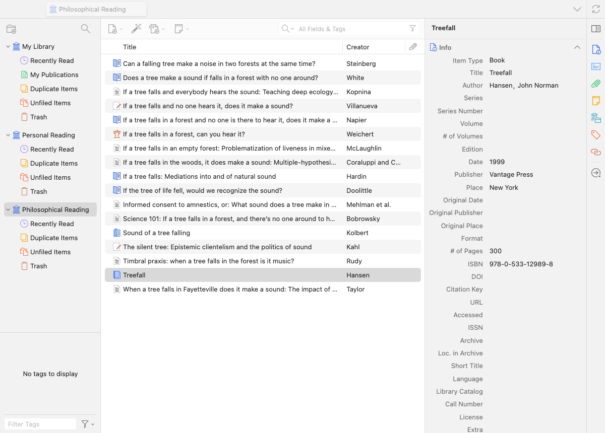
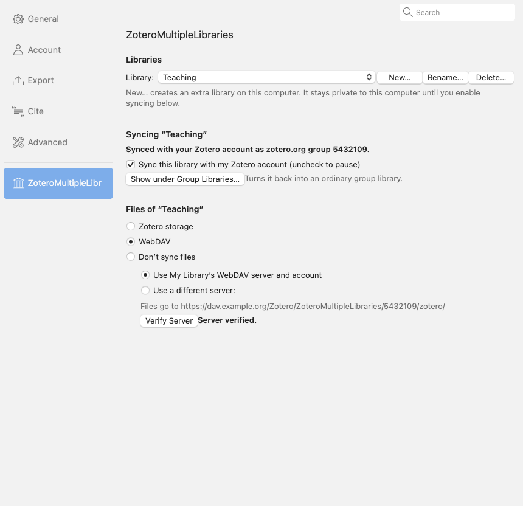

# ZoteroMultipleLibraries

A Zotero plugin that gives you several personal libraries in one Zotero,
side by side in the collection tree: "My Library", "Personal Reading",
"Teaching", … Each extra library works like My Library: its own collections,
saved searches, tags, Duplicate Items, Unfiled Items, Retracted Items, Trash,
notes, attachments, reader tabs, full-text search, and drag and drop between
libraries. An extra library can stay on this computer only, or sync with your
Zotero account with its attachment files on a WebDAV server of its own.



## Why not multiple profiles?

Zotero's documented workaround for separate libraries is a second profile with
its own data directory. That means restarting Zotero to switch, no drag and
drop or "Add to Collection" across libraries, and plugins, preferences, Word
integration, and the browser connector all tied to one profile at a time.
Group libraries are the other option, but they must be created on zotero.org,
sync only to Zotero storage, and sit under "Group Libraries".

This plugin instead uses what Zotero already has: its database is
multi-library by design (My Library, groups, feeds). An extra library is an
additional library in that database, shown and managed as a first-class
library. [docs/DESIGN.md](docs/DESIGN.md) explains the choice in detail,
including what was ruled out and why.

## Install

1. Download the `.xpi` from the releases page (or build it with `./build.sh`).
2. In Zotero: Tools → Plugins → gear icon → Install Plugin From File…

Requires Zotero 10 (developed and tested on 10.0.4).

## Use

- **New library**: File → New Library…, or right-click anywhere in the
  collection tree → New Library…
- **Rename**: right-click the library → Rename Library…, or double-click it.
- **Delete**: right-click the library → Delete Library… (asks for
  confirmation; deletes the library, its items, and attachment files stored in
  Zotero).
- **Settings**: right-click the library → Library Settings…, or Settings →
  ZoteroMultipleLibraries.
- Everything else is plain Zotero: create collections and saved searches in
  the library, drag items between libraries, import files into it, save from
  the browser connector while it is selected, cite from it in Word.

Preference (Settings → Advanced → Config Editor):
`extensions.zotero.multipleLibraries.separators` draws a thin line between
libraries in the tree (default: on).

## Syncing an extra library

A new library is **local**: it exists only in this Zotero's data directory,
is never synced, and does not count against your Zotero storage.

To sync it with the **same Zotero account**, it has to become a group of that
account, because an account has exactly one personal library on zotero.org.
So:

1. On zotero.org, create a group (Groups → Create a New Group), private,
   members only.
2. Sync once: Zotero downloads the new group as an empty group library.
3. In Zotero: Settings → ZoteroMultipleLibraries, select the library, pick the
   group from "Empty groups on this computer" (or enter its numeric ID, the
   number in its web address), click Link to Group and confirm. The empty
   group library is replaced by your library. A group that already contains
   items cannot be linked.
4. Sync. Zotero's own sync uploads the library's content to that group and
   takes the group's name and permissions from zotero.org. From then on it
   syncs like any other library, while the plugin keeps showing it at the top
   level of the tree. The "Sync this library with my Zotero account" checkbox
   in the pane turns its sync off and on (Zotero's own "libraries to skip"
   setting).



**Attachment files** of a linked library can go to one of:

- *Don't sync files* (default after linking);
- *Zotero storage*, the normal group behaviour (counts against the group
  owner's Zotero storage quota);
- *WebDAV*, with the library's own URL, username, and password, verified with
  Verify Server. Zotero stores the files in a `zotero` subfolder of that URL,
  so give each library its own folder; the pane refuses the folder My Library
  uses or one already used by another extra library. The password is kept in
  Zotero's login manager under a realm specific to that library. Your Zotero
  account credentials and your existing WebDAV settings are never read or
  changed by the plugin.

Every Zotero that syncs that group with this plugin installed and the same
WebDAV settings sees the files; a Zotero without the plugin sees the group as
an ordinary group library whose files are "not found" until the plugin is
installed there too.

Linking cannot be undone from within Zotero. Items from the library that were
already cited in word-processor documents before linking may need to be
reselected once, because their identifiers change with the group ID.

## What happens if the plugin is disabled or removed

Nothing is lost. The extra libraries are ordinary editable libraries in your
Zotero database; without the plugin they are listed under "Group Libraries"
with their names and stay fully usable. Local libraries are registered in
Zotero's own "libraries to skip" sync preference, so Zotero never tries to
sync them or offers to delete them, with or without the plugin. Linked
libraries keep syncing as groups (files from WebDAV need the plugin). Enable
the plugin again and everything returns to the top level.

## Limitations

- Linked files (attachments that point to files outside the Zotero data
  directory) cannot be added to extra libraries, the same restriction Zotero
  applies to group libraries. Stored files work normally.
- My Publications exists only in My Library.
- If you are signed in to a Zotero account, items and annotations you create
  in an extra library record your account's user ID, as in group libraries.
- The sync of a linked library against zotero.org itself is Zotero's own code
  and was not exercised in the plugin's tests (they run without a Zotero
  account); linking, the tree, and WebDAV file syncing were tested against a
  local server.

## Development

```bash
tools/test-profile.sh          # start a throwaway Zotero with the plugin (never touches your real library)
tools/webdav-server.sh start   # local WebDAV server for the file-sync test (macOS Apache, 127.0.0.1:8089)
tools/zml-exec.sh -f tests/02-tree.js   # run a smoke test inside the test instance
tools/snapshot.sh out.png      # screenshot of the test window
./build.sh                     # build/zotero-multiple-libraries-<version>.xpi
```

The test instance has its own profile and data directory under
`tools/.test/`, runs Zotero's HTTP server on port 23129, and installs the
plugin unpacked from the source tree together with `tools/dev-bridge`, a
development-only plugin that runs JavaScript posted to
`/zml-dev/exec`. Never install the dev bridge in a real profile. The tests
never contact zotero.org and never touch a real account or WebDAV server.

Source layout:

- `bootstrap.js` — plugin lifecycle
- `src/zml.js` — main object, loads the modules below
- `src/settings.js` — per-library configuration in Zotero's settings table
- `src/libraries.js` — create / rename / delete / list libraries, link to a group
- `src/core.js` — keeps managed libraries out of the Group Libraries section and local ones out of sync
- `src/storage.js` — per-library WebDAV file syncing
- `src/tree.js` — shows the libraries at the top level of the collection tree
- `src/ui.js` — menus and dialogs
- `content/` — the preferences pane
- `locale/en-US/` — Fluent strings
- `tests/` — smoke tests run through the dev bridge

## License

MIT, see [LICENSE](LICENSE).
