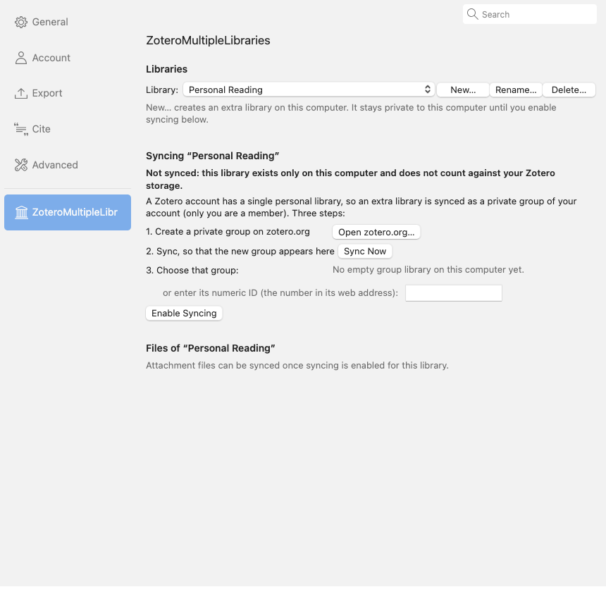

# ZoteroMultipleLibraries

A Zotero plugin that gives you several personal libraries in one Zotero,
side by side in the collection tree: "My Library", "Personal Reading",
"Teaching", … Each extra library works like My Library: its own collections,
saved searches, tags, Duplicate Items, Unfiled Items, Retracted Items, Trash,
notes, attachments, reader tabs, full-text search, and drag and drop between
libraries. An extra library can stay on one computer only, or sync with your
Zotero account and keep its attachment files on Zotero storage or on a WebDAV
server, with the same settings followed automatically on your other computers.


Under the hood an extra library is an additional library in Zotero's own
database, the same kind Zotero uses for group libraries, presented and
managed as a first-class library. [docs/DESIGN.md](docs/DESIGN.md) explains
the design, the alternatives that were ruled out, and what the tests cover.

## Requirements

Zotero 10 (developed and tested on 10.0.4 and 10.0.5).

## Install

1. Download the `.xpi` from the
   [releases page](https://github.com/gchapron/ZoteroMultipleLibraries/releases)
   (or build it with `./build.sh`).
2. In Zotero: Tools → Plugins → gear icon → Install Plugin From File…

## Everyday use

- **New library**: File → New Library…, or right-click anywhere in the
  collection tree → New Library…
- **Rename**: right-click the library → Rename Library…, or double-click it.
- **Delete**: right-click the library → Delete Library… (asks for
  confirmation; deletes the library, its items, and attachment files stored in
  Zotero from this computer).
- **Settings** (syncing, files): right-click the library → Library Settings…,
  or Settings → ZoteroMultipleLibraries.
- Everything else is plain Zotero: create collections and saved searches in
  the library, drag items between libraries, import files into it, save from
  the browser connector while it is selected, cite from it in Word.

Preference (Settings → Advanced → Config Editor):
`extensions.zotero.multipleLibraries.separators` draws a thin line between
libraries in the tree (default: on).

## Syncing

Settings → ZoteroMultipleLibraries has three parts: the libraries, the syncing
of the selected library, and its files.



A new library is **not synced**: it exists only in this Zotero's data
directory and does not count against your Zotero storage. There are two ways
to get a synced extra library:

- **Enable syncing for a local library.** A Zotero account has exactly one
  personal library on zotero.org, so an extra library is synced as a private
  group of your account (only you are a member). The pane walks you through
  it: 1. create a private group on zotero.org (button), 2. Sync Now, so that
  the new, empty group appears on this computer, 3. choose it (or type its
  numeric ID), then Enable Syncing. Zotero's own sync uploads the library's
  content to that group and takes the group's name from zotero.org; the
  plugin keeps showing it at the top level of the tree.
- **Show a group library as an extra library.** Any group library on this
  computer can be turned into an extra library (Libraries section, or
  right-click it under "Group Libraries" → Show as Extra Library).


For a synced library, "Sync this library with my Zotero account" pauses or
resumes its sync (Zotero's own "libraries to skip" setting), and "Show under
Group Libraries…" turns it back into an ordinary group library.

### Files

Files of a synced library go to one of:

- **Zotero storage**, the default: files sync through Zotero storage whatever
  Zotero's Sync setting for group libraries says, and count against your
  Zotero storage quota as the group's owner;
- **WebDAV**, either *using My Library's WebDAV server and account*, in a
  folder of its own (`<My Library's URL>/ZoteroMultipleLibraries/<group ID>/`,
  created when you verify; the plugin asks Zotero's own WebDAV code for the
  password at sync time and never stores a copy), or *a different server*
  with its own URL, username, and password. Verify Server checks the folder.
  Your Zotero account credentials and your existing WebDAV settings are never
  changed by the plugin;
- **Don't sync files**.

Changing where files live resets the library's file sync history, as Zotero
does for My Library: files on this computer are uploaded to the new place at
the next sync, missing ones fetched from there. The same happens when a
WebDAV-synced library is shown under Group Libraries again: its files then
follow Zotero's rule for group libraries (Zotero storage), files already on
this computer are kept and uploaded there if group file syncing is on, and
files that exist only on the WebDAV server are not transferred.

### Your other computers

The plugin stores, in the group's own settings on zotero.org, a marker saying
that the group is an extra library together with its file syncing choice
(mode, and for a WebDAV server its address and username, never a password).
So on another computer with the plugin, after a sync, the library appears as
an extra library by itself, with the same file syncing: nothing to create or
link there. If the choice is "use My Library's WebDAV server", it works right
away with that computer's own My Library credentials; for a different WebDAV
server, enter its password once in Library Settings…. Changes to the choice
on any computer propagate to the others. A library adopted without such a
marker starts with no file syncing until you choose, because the choice has
to be the same everywhere.

Enabling syncing cannot be undone from within Zotero. Items from the library
that were already cited in word-processor documents before that may need to
be reselected once, because their identifiers change with the group ID.

## What happens if the plugin is disabled or removed

Nothing is lost. The extra libraries are ordinary editable libraries in your
Zotero database; without the plugin they are listed under "Group Libraries"
with their names and stay fully usable. Local libraries are registered in
Zotero's own "libraries to skip" sync preference, so Zotero never tries to
sync them or offers to delete them, with or without the plugin. Synced
libraries keep syncing as groups (files from a WebDAV server need the plugin).
Enable the plugin again and everything returns to the top level.

## Limitations

- Linked files (attachments that point to files outside the Zotero data
  directory) cannot be added to extra libraries, the same restriction Zotero
  applies to group libraries. Stored files work normally.
- My Publications exists only in My Library.
- Items and annotations you create in a synced extra library record your
  account's user ID, as in group libraries.
- The automated tests run without a Zotero account: they cover the tree,
  linking, adopting, shared settings, and WebDAV file syncing against a local
  server; the sync of a group against zotero.org itself is Zotero's own code
  and is exercised only by real use.

## Development

```bash
tools/test-profile.sh          # start a throwaway Zotero with the plugin (never touches your real library)
tools/webdav-server.sh start   # local WebDAV server for the file-sync tests (macOS Apache, 127.0.0.1:8089)
tools/zml-exec.sh -f tests/02-tree.js   # run a smoke test inside the test instance
tools/snapshot.sh out.png      # screenshot of the test window
./build.sh                     # build/zotero-multiple-libraries-<version>.xpi
```

The test instance has its own profile and data directory under
`tools/.test/`, runs Zotero's HTTP server on port 23129, and installs the
plugin unpacked from the source tree together with `tools/dev-bridge`, a
development-only plugin that runs JavaScript posted to
`/zml-dev/exec`. Never install the dev bridge in a real profile. The tests
never contact zotero.org and never touch a real account or WebDAV server.

Source layout:

- `bootstrap.js` — plugin lifecycle
- `src/zml.js` — main object, loads the modules below
- `src/settings.js` — per-library configuration in Zotero's settings table
- `src/libraries.js` — create / rename / delete / list libraries, link to a group, adopt a group
- `src/core.js` — keeps managed libraries out of the Group Libraries section and local ones out of sync
- `src/storage.js` — per-library file syncing (WebDAV)
- `src/shared.js` — settings shared between computers through the group
- `src/tree.js` — shows the libraries at the top level of the collection tree
- `src/ui.js` — menus and dialogs
- `content/` — the preferences pane
- `locale/en-US/` — Fluent strings
- `tests/` — smoke tests run through the dev bridge

## License

MIT, see [LICENSE](LICENSE).
